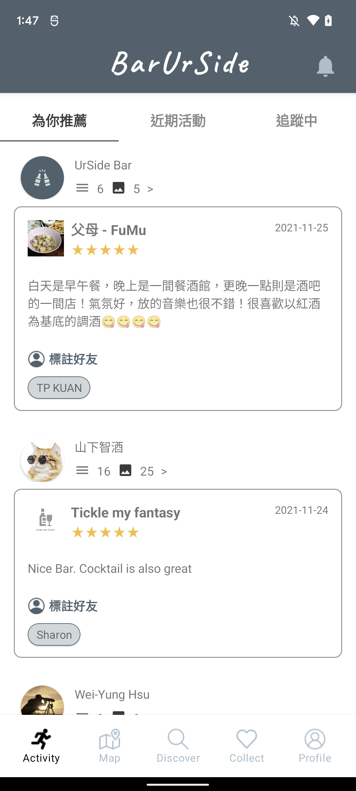

#  BarUrSide

BarUrSide explores nearby top-rated bars/drinks,
provides suitable bars based on user demand to enhance user's drinking experience. Cheers!

## Features

### Activity

- Overview  
  Activity page display recent tastings and ratings shared from user's friends and recommended KOL (Key Opinion Leader).

- Published Rating Tab  
  Publish list of newly rating user post, including score, comment and related pictures.

   

- Activity Tab  
  List recent tastings, user can click activity to check detailed information, then join it or share to friends. Click the plus button to create your own tasting.

   

### Map

- Overview  
  Present in Google Map, allowing users to choose venue based on distance conditions

- Nearby venue  
  Show the venue within one kilometer of the user’s location. Click on the wine glass icon to quickly check the venue name and rating, click window will navigate to venue page.

   

- Filter venue  
  Filter venue based on price range, sotre style, drink selled by the venue and distance, then list eligible venue after submit. If you are suffering from decidophobia, click random button, BarUrSide will pick a venue for you.

   

### Discover

- Overview  
  Recommend venue in a thematic way, can also search for venue/drink.

- Theme  
  Themes including top-rated venues/drinks, trending venues/drinks, nearby venues and recent tastings. User can choose theme interested and BarUrSide will show the list of venues/drinks related.

   

- Search  
  Search for the venue or wine you want to know more about.

   

### Venue & Drink

- Venue Page  
  Display foundmantal information including address, service, phone etc., recommend drink, newest ratings and images user posted. If you are interested in the venue, you can add it to the collection.

   

- Menu & Drink  
  Click "check menu" view drinks which venue sell. Drink page provide information including price, taste, rating etc. If drink not in the menu, click plus button to add drink by yourself.

   

- Check Rating  
  click "check all" to view all rating, also can view the comments under each score.

   

- Add Venue & Add Drink

   &nbsp;&nbsp;  

- Add Rating  
  User can comment on the venue, also can comment drink by clicking "add drink comment" button

   

### Collect
List the collect venues/drinks and show the distance between user's location and venue.

 

### Profile
Display rating posted by users, user's friends and activty booked.

 

## Techniques

- Android
  - Kotlin
  - App Components
  - Coroutines
  - Unit Test

- Patterns
  - Model-View-ViewModel
  - Object-Oriented Programming
  - Observer
  - Singleton

- Jetpack
  - Lifecycle
  - LiveData
  - Navigation
  - Data binding
  - Permissions
  - Notifications

## Tools

- Google Cloud Platform API
  - Google Map API
  - Google Place API
  - Google OAuth

- Firebase
  - Firestore
  - Storage
  - Authentication
  - Crashlytics

- Others
  - Glide
  - Lottie
  - Git & GitHub

## Development Environment

**Android Studio** - Arctic Fox | 2020.3.1 Patch 2

**Android SDK** - 28+

**Gradle** - 7.0.2

## Latest Version

5.6.10

## Contact

Ming-Yu Wu barurside@gmail.com
